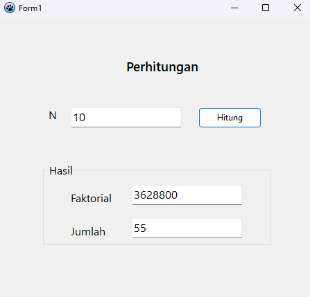
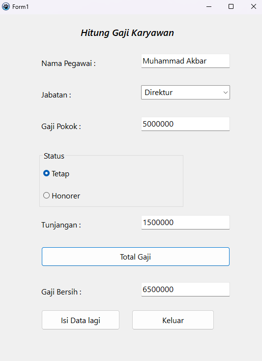
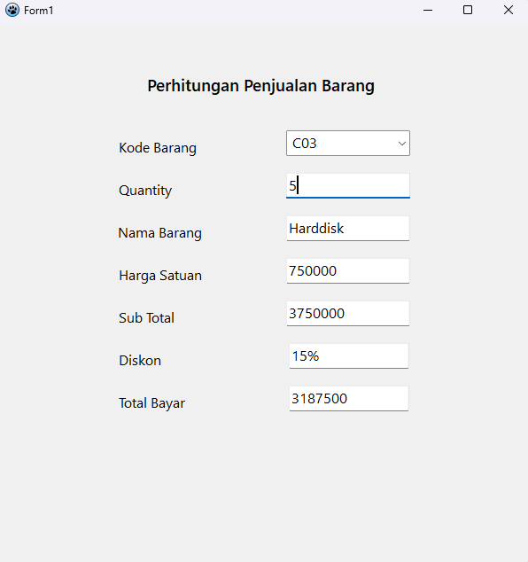

## TUGAS 1 (Pemprograman Visual)

```
Nama   : Muhammad Akbar
Nim    : 312110483
Kelas  : TI.21.A.3
Matkul : Pemprograman Visual - Desktop
Dosen  : Agung Nugroho, S.Kom., M.Kom.
```

### Latihan 1 (Perhitungan Jumlah Deret Faktorial)



### Latihan 2 (Perhitung Gaji Karyawan)



### Latihan 3 (Perhitungan Penjualan Barang)


